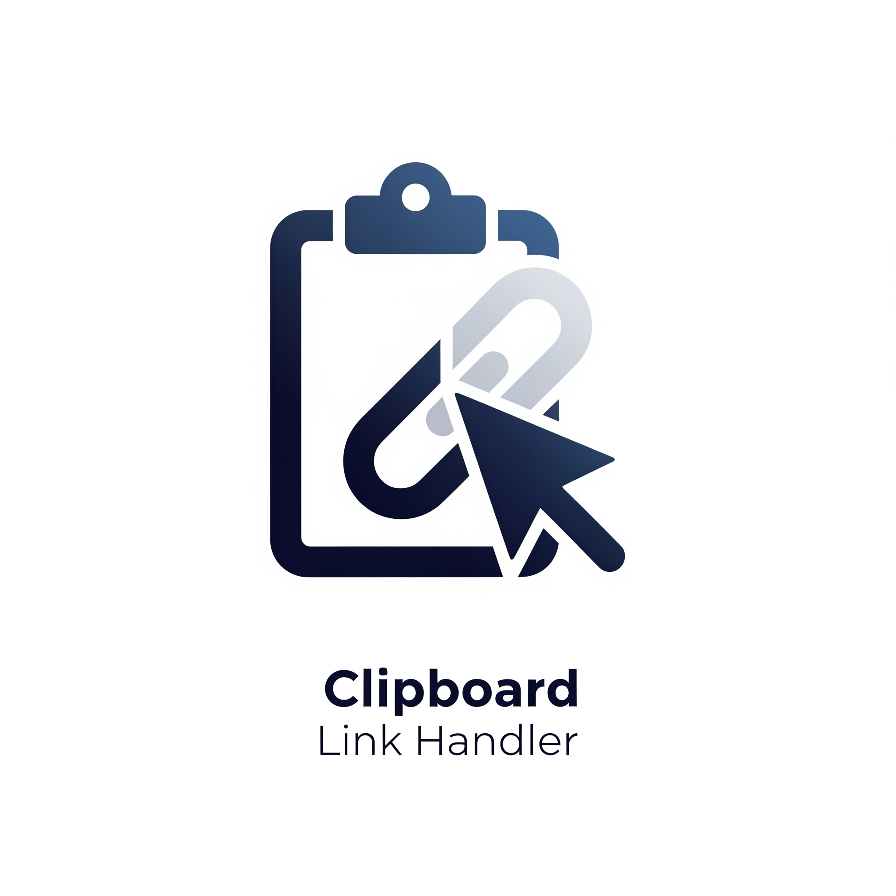

# 📋 Simple Python clipboard handler

 <!-- Sostituisci con la tua immagine/logo -->

---

## 🚀 Description

Simple Python clipboard handler is an advanced tool designed to boost your productivity by continuously **monitoring your clipboard** for links. It identifies these links based on customizable rules and allows you to **perform personalized actions** such as downloading, opening, or processing them, all through an intuitive interface.
This tool is perfect for users who want to **automate and customize** the management of copied links, whether they are for playlists, media files, or scripts.

---

## ✨ Main features

- *Real-time Clipboard Monitoring*: identify links instantly using customizable regular expressions.
Configurable Quick Actions: Easily select, launch, and view outputs for each identified link.
- *Visual History*: access a chronological view with color-coded results for quick assessment (green/red).
- *Detailed Output*: Store, search, and copy the output/text of each operation effortlessly.
- *Simple Configuration*: utilize a user-friendly .ini file editor for easy setup and customization.
- *Autorun and Autoclose*: streamline processes with automated default actions and tab management.
- *Advanced Support*: leverage pre-execution filters and shell scripts for enhanced functionality.

[](https://github.com/mik1981/link_monitor/stargazers)
[](https://github.com/mik1981/link_monitor/fork)
[](https://github.com/mik1981/link_monitor/issues)

If you like this project, consider:

- ⭐ **Star this repository** to support the project and help others discover it!
- 🛠️ **Contribute** with code, ideas, or bug reports by opening an [issue](https://github.com/mik1981/link_monitor/issues) or a [pull request](https://github.com/mik1981/link_monitor/pulls).
- 📣 **Share it** with others who might find it useful!

---

## 🖼️ Interface preview

| Historical | Available actions | Configuration example |
|--------------------|-------------------|-------------------|
|  |  |  |

---

## 🛠️ Installation

1. Clone the repository:
    ```sh
    git clone git@github.com:mik1981/Simple-Python-Clipboard-Handler.git
    cd Simple-Python-Clipboard-Handler
    ```

2. Install the dependencies:
    ```sh
    pip install -r requirements.txt
    ```

3. Prepare your rules in the `config.ini` file.

---

## 🚦 Quick Start
```sh
python link_monitor.py
```

- Copy a compatible link: the GUI will display buttons for each expected pre-configurated action.
- Consult the "History" tab for all past activity.

---

## 📋 Configurazione example (`config.ini`)
```ini
[DICT_REGEX]
youtube_download = https?://.youtube.com/watch.

[DICT_PROGRAMS]
yt_downloader = C:\Users\Pasinelli\Desktop\Archivio\Script\yt-dl\yt-dlp.exe

[FILTERS]
yt_pattern = (&list.*)
yt_replace =

[LINKS]
regex1 = youtube_download
program1 = yt_downloader -x --audio-format mp3 {url}
label1 = Scarica come mp3
filter1 = yt
autorun1 = True
```


---

## 💡 Usage Tips

- Modify the configuration file to incorporate new services or adjust existing commands.
- Select your preferred action, like **autorun**, to enhance workflow efficiency.
- Delve into the **history** to effortlessly replay, analyze, or copy links.
- Personalize colors and shortcuts to align with your workflow!

---

## 📈 Advanced Features

- Visual history coloring (success/error).
- Output detail on the right for each selected operation.
- Quick preview and test of regexes and filters.

---

## 🤝 Contributions

Do you have any ideas or suggestions? Make a **pull request** or open an **issue**!

---

## 🧑‍💻 Author and Donations

Created by [Gian Michele Pasinelli](mailto:caludia@tiscali.it).
If you find the project useful, you can buy me a coffee ☕ via [PayPal](https://www.paypal.me/gianmichelepasinelli).

---

## License

[MIT](http://opensource.org/licenses/MIT)

---

> _"Automate and efficiently manage every link that enters your clipboard!"_


